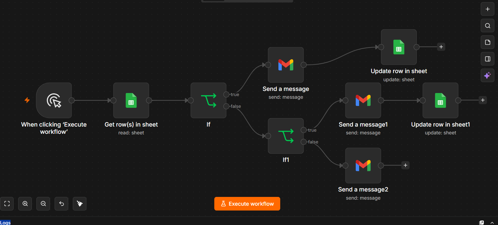
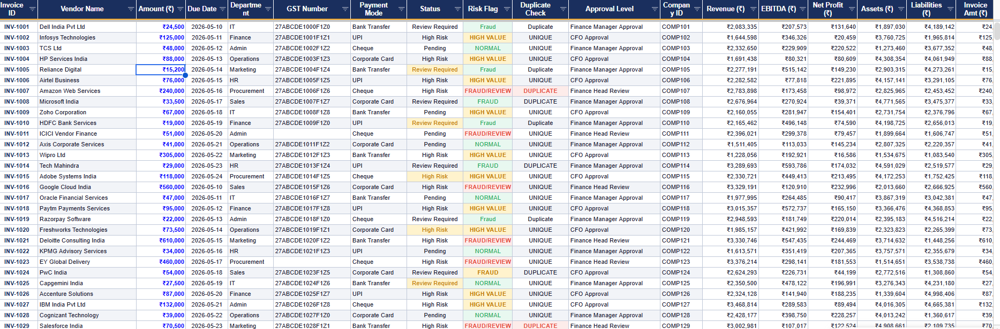
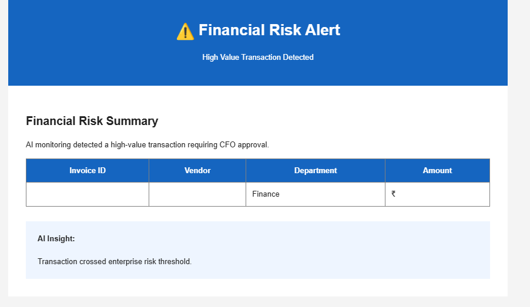
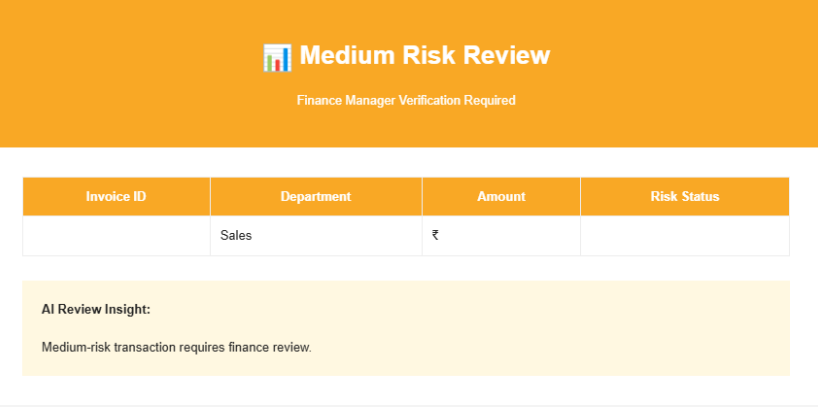

# Vendor Payment Automation using n8n

## Overview

Vendor Payment Automation is an n8n workflow designed to automate invoice monitoring, payment risk assessment, approval notifications, and payment tracking. The workflow helps finance teams streamline vendor payment processes while reducing manual effort and payment risks.

---

## Features

- Automated invoice processing
- Risk-based payment classification
- High-risk transaction alerts
- Medium-risk transaction alerts
- Google Sheets integration for payment tracking
- Automated email notifications
- Centralized workflow management using n8n

---

## Workflow Architecture



### Process Flow

1. Invoice data is received.
2. Payment details are validated.
3. Risk assessment logic categorizes transactions.
4. Alerts are generated based on risk level:
   - High Risk
   - Medium Risk
5. Payment records are updated in Google Sheets.
6. Stakeholders receive automated notifications.

---

## Project Structure


---

## Screenshots

### Workflow Design


### Google Sheet Integration



### High Risk Alert



### Medium Risk Alert



---

## Technologies Used

- n8n
- Google Sheets
- Email Notifications
- Workflow Automation
- Risk Assessment Logic

---

## Installation

1. Clone the repository:

```bash
git clone https://github.com/<your-username>/vendor_payment_automation_n8n-MBA.git
